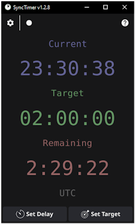

A simple Go app for displaying remaining time

:floppy_disk: [Latest release](https://github.com/zwk-app/SyncTimer/releases/latest)

And also a quite good sandbox to learn GoLang :satisfied:

*GoLang by [Renee French](https://reneefrench.blogspot.com/), [Creative Commons 4.0 Attributions license](https://creativecommons.org/licenses/by/4.0/)*
